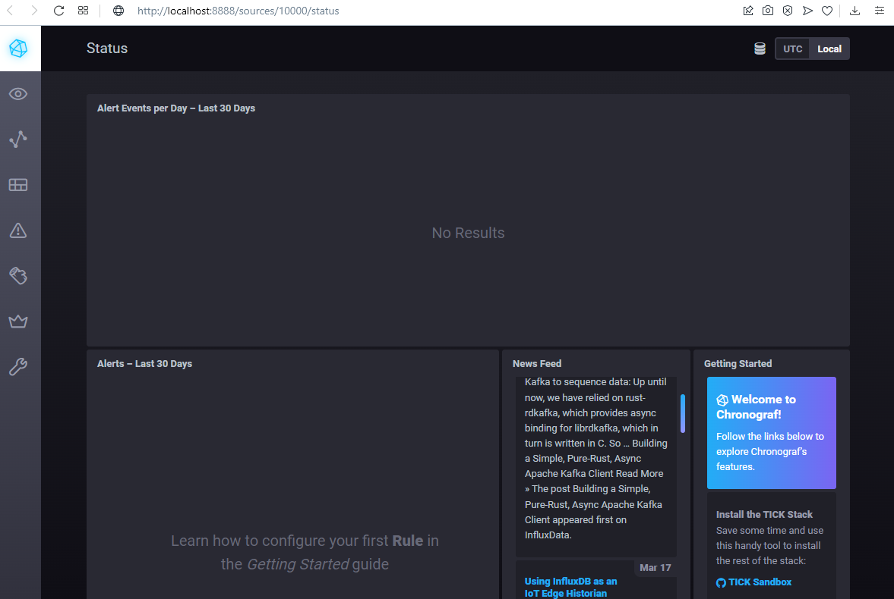
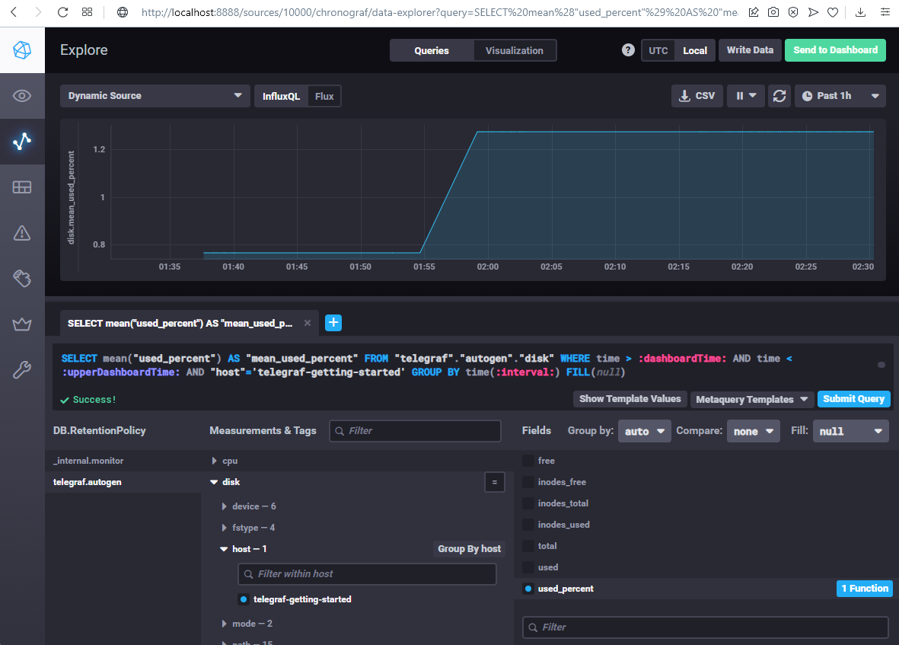
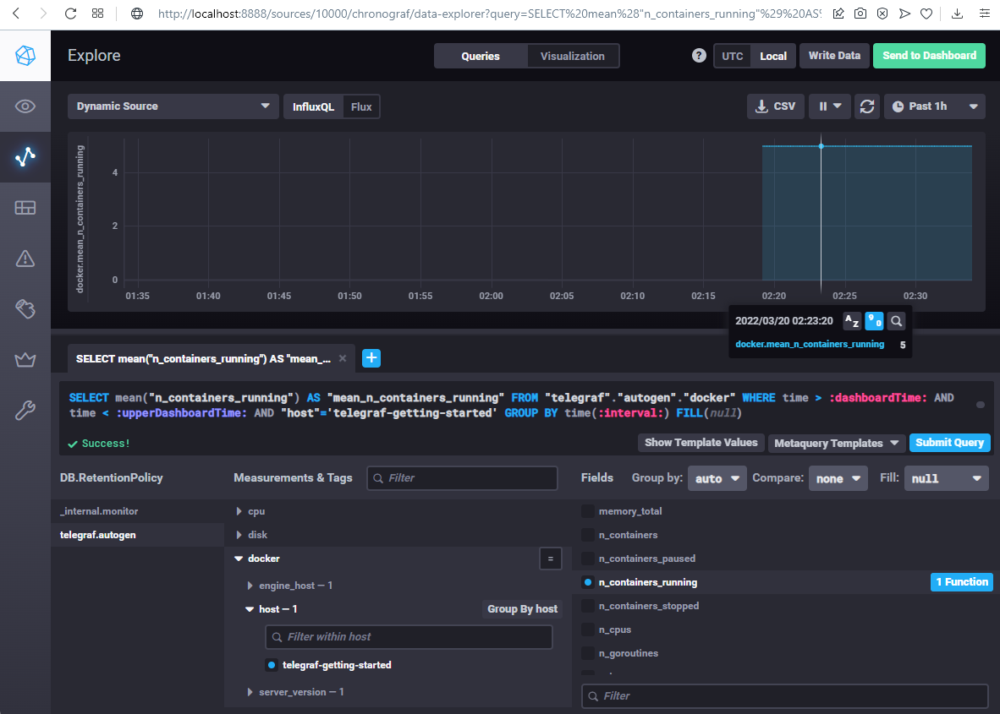

1. Плюсы Push-модели:

    - Упрощение репликации данных в разные системы мониторинга или их резервные копии (на клиенте настраивается конечная точка отправки или набор таких точек)
    - Более гибкая настройка отправки пакетов данных с метриками (на каждом клиенте задается объем данных и частоту отправки)
    - UDP является менее затратным способом передачи данных, вследствии чего может вырости производительность сбора метрик (обратной стороной медали является гарантия доставки пакетов)

Плюсы Pull-модели:

    - Легче контролировать подлинность данных (гарантия опроса только тех агентов, которые настроены в системе мониторинга)
    - Можно настроить единый proxy-server до всех агентов с TLS (таким образом мы можем разнести систему мониторинга и агенты, с гарантией безопасности их взаимодействия)
    - Упрощенная отладка получения данных с агентов (так как данные запрашиваются посредством HTTP, можно самостоятельно запрашивать эти данные, используя ПО вне системы мониторинга)

2. Все гибридные, кроме Nagios (только pull). Prometheus по умолчанию (основной режим) pull, а TICK push.

3.
        $ curl http://localhost:8888/
        <!DOCTYPE html><html><head><meta http-equiv="Content-type" content="text/html; charset=utf-8"><title>Chronograf</title><link rel="icon shortcut" href="/favicon.fa749080.ico"><link rel="stylesheet" href="/src.14d28054.css"></head><body> 

  </body></html>

        $ curl -i http://localhost:9092/kapacitor/v1/ping
        HTTP/1.1 204 No Content
        Content-Type: application/json; charset=utf-8
        Request-Id: c8abbfa2-a7ce-11ec-806f-000000000000
        X-Kapacitor-Version: 1.6.3
        Date: Sat, 19 Mar 2022 21:51:51 GMT

        $ curl -i http://localhost:8086/ping
        HTTP/1.1 204 No Content
        Content-Type: application/json
        Request-Id: 43d08a2b-a7d0-11ec-813e-0242ac150003
        X-Influxdb-Build: OSS
        X-Influxdb-Version: 1.8.10
        X-Request-Id: 43d08a2b-a7d0-11ec-813e-0242ac150003
        Date: Sat, 19 Mar 2022 22:02:27 GMT

    
    
4.
    
5.
    