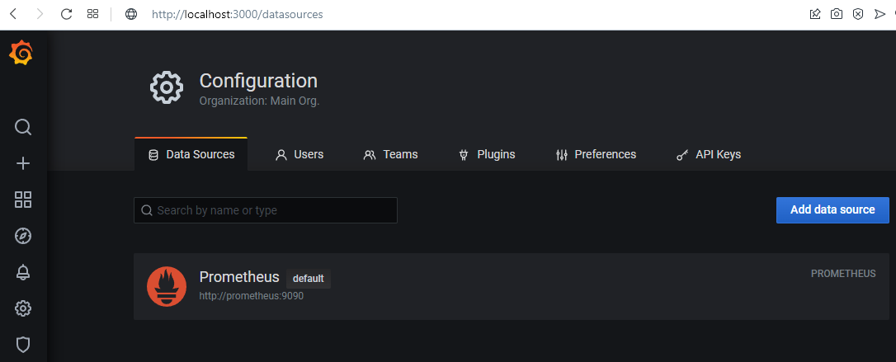
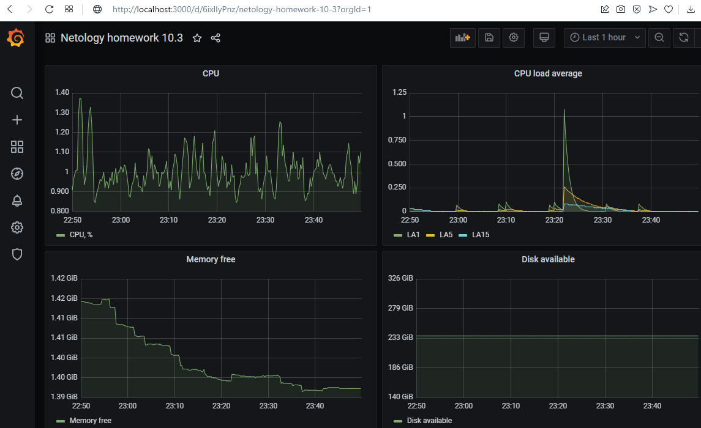
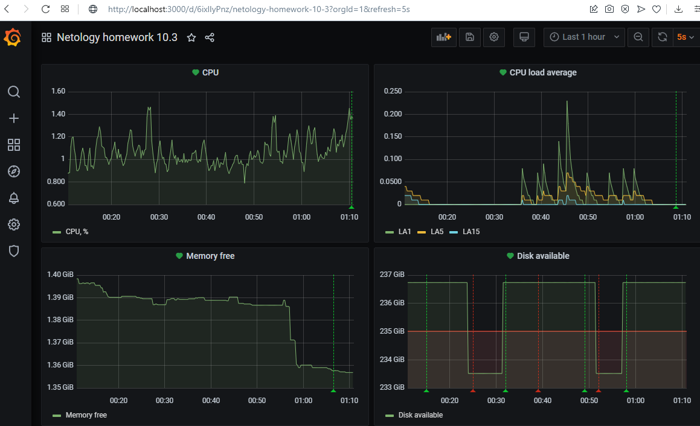

1.
    

2.
        100 - (avg by (instance) (rate(node_cpu_seconds_total{instance="nodeexporter:9100",mode="idle"}[1m]))*100)

        node_load1{instance="nodeexporter:9100"}
        node_load5{instance="nodeexporter:9100"}
        node_load15{instance="nodeexporter:9100"}

        node_memory_MemFree_bytes{instance="nodeexporter:9100"}

        node_filesystem_avail_bytes{instance="nodeexporter:9100",mountpoint="/"}

    

3.
    
    
4.
    [JSON MODEL](10.3_files/json_model.txt)