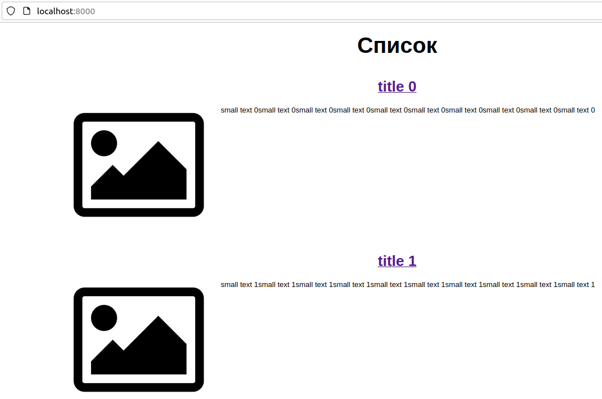

## Задание 1: подготовить тестовый конфиг для запуска приложения

.env файлы нужны для docker-compose.yml, в Kubernetes они не будут работать. Поэтому надо будет прописать эти данные через env в yaml-файле.

    alex@AlexAsusLinux:~/netology/devkub-homeworks/13-kubernetes-config/backend$ docker build -t hw131-backend .
    ...
    Successfully built a4864932672b
    Successfully tagged hw131-backend:latest

    alex@AlexAsusLinux:~/netology/devkub-homeworks/13-kubernetes-config/frontend$ docker build -t hw131-frontend .
    ...
    Successfully built e40ce92b39de
    Successfully tagged hw131-frontend:latest

    alex@AlexAsusLinux:~/netology$ minikube start

    alex@AlexAsusLinux:~/netology/13-1-config$ kubectl get sc
    NAME                 PROVISIONER                RECLAIMPOLICY   VOLUMEBINDINGMODE   ALLOWVOLUMEEXPANSION   AGE
    standard (default)   k8s.io/minikube-hostpath   Delete          Immediate           false                  13m

Создаем [db.yaml](13.1_files/db.yaml) и [app.yaml](13.1_files/app.yaml)

    alex@AlexAsusLinux:~/netology/13-1-config$ kubectl apply -f db.yaml

    alex@AlexAsusLinux:~/netology/13-1-config$ eval $(minikube docker-env)

    alex@AlexAsusLinux:~/netology/13-1-config$ kubectl apply -f app.yaml

    alex@AlexAsusLinux:~/netology/13-1-config$ kubectl get pods
    NAME                          READY   STATUS    RESTARTS   AGE
    db-0                          1/1     Running   0          56m
    front-back-69778b9559-t68zq   2/2     Running   0          8s

    alex@AlexAsusLinux:~/netology/13-1-config$ kubectl port-forward service/front 8000:8000
    Forwarding from 127.0.0.1:8000 -> 80
    Forwarding from [::1]:8000 -> 80

    alex@AlexAsusLinux:~/netology/13-1-config$ kubectl port-forward pod/front-back-69778b9559-t68zq 9000:9000
    Forwarding from 127.0.0.1:9000 -> 9000
    Forwarding from [::1]:9000 -> 9000

Открываем в браузере http://localhost:8000/  

  

Убедимся, что БД работает:

    alex@AlexAsusLinux:~/netology/13-1-config$ kubectl exec db-0 -it -- /bin/bash
    bash-5.1# psql -U postgres
    psql (13.6)
    Type "help" for help.

    postgres=# \l
                                     List of databases
       Name    |  Owner   | Encoding |  Collate   |   Ctype    |   Access privileges   
    -----------+----------+----------+------------+------------+-----------------------
     news      | postgres | UTF8     | en_US.utf8 | en_US.utf8 | 
    ...

    postgres=# \c news
    You are now connected to database "news" as user "postgres".

    news=# \dt
            List of relations
     Schema | Name | Type  |  Owner   
    --------+------+-------+----------
     public | news | table | postgres
    (1 row)

    news=# SELECT id, title, preview FROM news;
     id |  title   |      preview      
    ----+----------+-------------------
      1 | title 0  | /static/image.png
      2 | title 1  | /static/image.png
      3 | title 2  | /static/image.png
    ...
     25 | title 24 | /static/image.png
    (25 rows)

## Задание 2: подготовить конфиг для production окружения

Сначала удалим текущий деплоймент:

    alex@AlexAsusLinux:/var/data$ kubectl delete deploy front-back
    deployment.apps "front-back" deleted

    alex@AlexAsusLinux:/var/data$ kubectl get pods
    NAME   READY   STATUS    RESTARTS   AGE
    db-0   1/1     Running   0          115m

По сути, почти все уже готово, надо разнести только фронтэнд и бэкэнд по разным деплойментам и добавить сервис для бэкэнда.  
  
Есть 1 нюанс. Вроде бы по логике хотелось сделать BASE_URL=http://back:9000, т.к. теперь бэкэнд в отдельном поде, и из пода фронтэнда через localhost до него уже не достучаться. Но по факту обращение к BASE_URL идет из браузера, а проверять мы будем через localhost компьютера (не пода), поэтому оставляем BASE_URL=http://localhost:9000  

Создаем [app-prod.yaml](13.1_files/app-prod.yaml)

    alex@AlexAsusLinux:~/netology/13-1-config$ kubectl apply -f app-prod.yaml
    deployment.apps/front created
    deployment.apps/back created
    service/front created
    service/back created

    alex@AlexAsusLinux:~/netology/13-1-config$ kubectl get pods
    NAME                     READY   STATUS    RESTARTS   AGE
    back-58d74977cc-6mmpb    1/1     Running   0          11s
    db-0                     1/1     Running   0          137m
    front-745f89b5fd-2z92m   1/1     Running   0          11s

    alex@AlexAsusLinux:~/netology/13-1-config$ kubectl get svc
    NAME         TYPE        CLUSTER-IP       EXTERNAL-IP   PORT(S)    AGE
    back         ClusterIP   10.103.206.22    <none>        9000/TCP   55s
    db           ClusterIP   None             <none>        5432/TCP   3h6m
    front        ClusterIP   10.109.128.201   <none>        8000/TCP   55s
    kubernetes   ClusterIP   10.96.0.1        <none>        443/TCP    3h9m

    alex@AlexAsusLinux:~/netology/13-1-config$ kubectl port-forward service/front 8000:8000
    alex@AlexAsusLinux:~/netology/13-1-config$ kubectl port-forward service/back 9000:9000

Открываем в браузере http://localhost:8000/, визуально все работает так же, как в п.1 задания.
