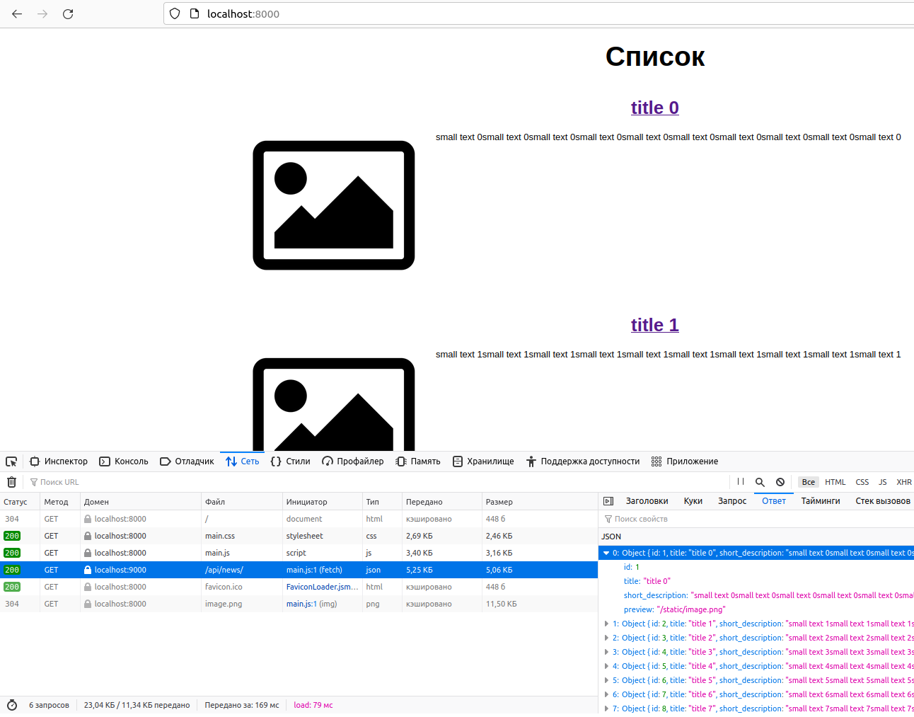

## Задание 1

Ресурсы запускаем те же, что в [ДЗ 13.1](https://github.com/at6man/devops-netology/blob/main/homeworks/13.1.md) для production окружения

    alex@AlexAsusLinux:~/netology/13-1-config$ kubectl get pods
    NAME                     READY   STATUS    RESTARTS   AGE
    back-58d74977cc-qj2p8    1/1     Running   0          8m13s
    db-0                     1/1     Running   0          9m3s
    front-745f89b5fd-xm2b9   1/1     Running   0          8m13s

    alex@AlexAsusLinux:~/netology/13-1-config$ kubectl get svc
    NAME         TYPE        CLUSTER-IP       EXTERNAL-IP   PORT(S)    AGE
    back         ClusterIP   10.110.132.221   <none>        9000/TCP   11m
    db           ClusterIP   None             <none>        5432/TCP   11m
    front        ClusterIP   10.103.0.36      <none>        8000/TCP   11m
    kubernetes   ClusterIP   10.96.0.1        <none>        443/TCP    12m

### Проверка через port-forward

    alex@AlexAsusLinux:~/netology/13-1-config$ kubectl port-forward service/front 8000:8000
    alex@AlexAsusLinux:~/netology/13-1-config$ kubectl port-forward service/back 9000:9000

Открываем в браузере http://localhost:8000/ (фронтэнд) и на вкладке сеть также видим запрос к бэкэнду:

    alex@AlexAsusLinux:~/netology/13-1-config$ kubectl port-forward service/db :5432
    Forwarding from 127.0.0.1:46369 -> 5432
    Forwarding from [::1]:46369 -> 5432

    alex@AlexAsusLinux:~/netology/13-1-config$ psql -h localhost -p 46369 -d news -U postgres
    psql (13.6 (Ubuntu 13.6-0ubuntu0.21.10.1))
    Type "help" for help.

    news=# SELECT id, title, preview FROM news LIMIT 3;
     id |  title  |      preview      
    ----+---------+-------------------
      1 | title 0 | /static/image.png
      2 | title 1 | /static/image.png
      3 | title 2 | /static/image.png
    (3 rows)

### Проверка через kubectl exec

    alex@AlexAsusLinux:~/netology/13-1-config$ kubectl exec db-0 -it -- psql -U postgres -d news
    psql (13.6)
    Type "help" for help.

    news=# SELECT id, title, preview FROM news LIMIT 3;
     id |  title  |      preview      
    ----+---------+-------------------
      1 | title 0 | /static/image.png
      2 | title 1 | /static/image.png
      3 | title 2 | /static/image.png
    (3 rows)

    alex@AlexAsusLinux:~/netology/13-1-config$ kubectl exec front-745f89b5fd-xm2b9 -it -- curl http://localhost:80/
    <!DOCTYPE html>
    <html lang="ru">
    <head>
        <title>Список</title>
        <meta charset="UTF-8">
        <meta name="viewport" content="width=device-width, initial-scale=1.0">
        <link href="/build/main.css" rel="stylesheet">
    </head>
    <body>
        <main class="b-page">
            <h1 class="b-page__title">Список</h1>
            

        </main>
        
    </body>
    </html>

    alex@AlexAsusLinux:~/netology/13-1-config$ kubectl exec back-58d74977cc-qj2p8 -it -- curl http://front:8000/
    <!DOCTYPE html>
    <html lang="ru">
    <head>
        <title>Список</title>
        <meta charset="UTF-8">
        <meta name="viewport" content="width=device-width, initial-scale=1.0">
        <link href="/build/main.css" rel="stylesheet">
    </head>
    <body>
        <main class="b-page">
            <h1 class="b-page__title">Список</h1>
            

        </main>
        
    </body>
    </html>

    alex@AlexAsusLinux:~/netology/13-1-config$ kubectl exec front-745f89b5fd-xm2b9 -it -- curl http://back:9000/api/news/
    [{"id":1,"title":"title 0","short_description":"small text 0small text 0small text 0small text 0small text 0small text 0small text 0small text 0small text 0small text 0","preview":"/static/image.png"},{"id":2,"title":"title 1","short_description":"small text 1small text 1small text 1small text 1small text 1small text 1small text 1small text 1small text 1small text 1","preview":"/static/image.png"},{"id":3,"title":"title 2","short_description":"small text 2small text 2small text 2small text 2small text 2small text 2small text 2small text 2small text 2small text 2","preview":"/static/image.png"}
    ...

    alex@AlexAsusLinux:~/netology/13-1-config$ kubectl exec back-58d74977cc-qj2p8 -it -- curl http://localhost:9000/api/news/
    [{"id":1,"title":"title 0","short_description":"small text 0small text 0small text 0small text 0small text 0small text 0small text 0small text 0small text 0small text 0","preview":"/static/image.png"},{"id":2,"title":"title 1","short_description":"small text 1small text 1small text 1small text 1small text 1small text 1small text 1small text 1small text 1small text 1","preview":"/static/image.png"},{"id":3,"title":"title 2","short_description":"small text 2small text 2small text 2small text 2small text 2small text 2small text 2small text 2small text 2small text 2","preview":"/static/image.png"}
    ...

## Задание 2: ручное масштабирование

    alex@AlexAsusLinux:~/netology/13-1-config$ kubectl scale --replicas=3 deploy/front
    deployment.apps/front scaled

    alex@AlexAsusLinux:~/netology/13-1-config$ kubectl scale --replicas=3 deploy/back
    deployment.apps/back scaled

    alex@AlexAsusLinux:~/netology/13-1-config$ kubectl get pods -o wide
    NAME                     READY   STATUS    RESTARTS   AGE   IP           NODE       NOMINATED NODE   READINESS GATES
    back-58d74977cc-gbpcn    1/1     Running   0          25s   172.17.0.8   minikube   <none>           <none>
    back-58d74977cc-qj2p8    1/1     Running   0          63m   172.17.0.4   minikube   <none>           <none>
    back-58d74977cc-vtcnm    1/1     Running   0          25s   172.17.0.9   minikube   <none>           <none>
    db-0                     1/1     Running   0          64m   172.17.0.3   minikube   <none>           <none>
    front-745f89b5fd-lmbgt   1/1     Running   0          30s   172.17.0.7   minikube   <none>           <none>
    front-745f89b5fd-lwj96   1/1     Running   0          30s   172.17.0.6   minikube   <none>           <none>
    front-745f89b5fd-xm2b9   1/1     Running   0          63m   172.17.0.5   minikube   <none>           <none>

    alex@AlexAsusLinux:~/netology/13-1-config$ kubectl scale --replicas=1 deploy/front
    deployment.apps/front scaled

    alex@AlexAsusLinux:~/netology/13-1-config$ kubectl scale --replicas=1 deploy/back
    deployment.apps/back scaled

    alex@AlexAsusLinux:~/netology/13-1-config$ kubectl get pods -o wide
    NAME                     READY   STATUS    RESTARTS   AGE   IP           NODE       NOMINATED NODE   READINESS GATES
    back-58d74977cc-qj2p8    1/1     Running   0          64m   172.17.0.4   minikube   <none>           <none>
    db-0                     1/1     Running   0          65m   172.17.0.3   minikube   <none>           <none>
    front-745f89b5fd-xm2b9   1/1     Running   0          64m   172.17.0.5   minikube   <none>           <none>
