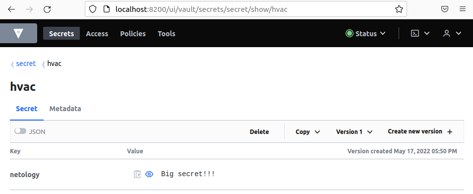

## Задача 1

    alex@AlexAsusLinux:~/netology/clokub-homeworks$ kubectl apply -f 14.2/vault-pod.yml
    pod/14.2-netology-vault created

    alex@AlexAsusLinux:~/netology/clokub-homeworks$ kubectl get pods
    NAME                  READY   STATUS    RESTARTS   AGE
    14.2-netology-vault   1/1     Running   0          2m25s

    alex@AlexAsusLinux:~/netology/clokub-homeworks$ kubectl get pod 14.2-netology-vault -o json | jq -c '.status.podIPs'
    [{"ip":"172.17.0.3"}]

    alex@AlexAsusLinux:~/netology/clokub-homeworks$ kubectl run -i --tty fedora --image=fedora --restart=Never -- sh
    If you don't see a command prompt, try pressing enter.
    
    sh-5.1# dnf -y install pip
    ...
    Installed:
      libxcrypt-compat-4.4.28-1.fc36.x86_64      python3-pip-21.3.1-2.fc36.noarch      python3-setuptools-59.6.0-2.fc36.noarch                              
    ...
    sh-5.1# pip install hvac
    ...     
    Successfully installed certifi-2021.10.8 charset-normalizer-2.0.12 hvac-0.11.2 idna-3.3 requests-2.27.1 six-1.16.0 urllib3-1.26.9
    ...

    sh-5.1# python3
    Python 3.10.4 (main, Mar 25 2022, 00:00:00) [GCC 12.0.1 20220308 (Red Hat 12.0.1-0)] on linux
    Type "help", "copyright", "credits" or "license" for more information.
    >>> import hvac
    >>> client = hvac.Client(
    ...     url='http://172.17.0.3:8200',
    ...     token='aiphohTaa0eeHei'
    ... )
    >>> client.is_authenticated()
    True
    >>> client.secrets.kv.v2.create_or_update_secret(
    ...     path='hvac',
    ...     secret=dict(netology='Big secret!!!'),
    ... )
    {'request_id': 'a538854e-7e9f-9da0-686b-e98c2ea5891c', 'lease_id': '', 'renewable': False, 'lease_duration': 0, 'data': {'created_time': '2022-05-17T14:50:29.965335119Z', 'custom_metadata': None, 'deletion_time': '', 'destroyed': False, 'version': 1}, 'wrap_info': None, 'warnings': None, 'auth': None}
    >>> client.secrets.kv.v2.read_secret_version(
    ...     path='hvac',
    ... )
    {'request_id': '3356910d-42f3-bb9e-c9c1-d6454807fa27', 'lease_id': '', 'renewable': False, 'lease_duration': 0, 'data': {'data': {'netology': 'Big secret!!!'}, 'metadata': {'created_time': '2022-05-17T14:50:29.965335119Z', 'custom_metadata': None, 'deletion_time': '', 'destroyed': False, 'version': 1}}, 'wrap_info': None, 'warnings': None, 'auth': None}

### Небольшие доп. эксперименты

Посмотрим этот секрет в поде Вольта:

    alex@AlexAsusLinux:~/netology/clokub-homeworks$ kubectl get pods
    NAME                  READY   STATUS    RESTARTS   AGE
    14.2-netology-vault   1/1     Running   0          34m
    fedora                1/1     Running   0          26m

    alex@AlexAsusLinux:~/netology/clokub-homeworks$ kubectl exec -it 14.2-netology-vault -- sh

    / # export VAULT_ADDR="http://127.0.0.1:8200"

    / # vault login
    Token (will be hidden): 
    Success! You are now authenticated. The token information displayed below
    is already stored in the token helper. You do NOT need to run "vault login"
    again. Future Vault requests will automatically use this token.

    Key                  Value
    ---                  -----
    token                aiphohTaa0eeHei
    token_accessor       hsMz8vkUZFsj3LIPggVbmvQM
    token_duration       ∞
    token_renewable      false
    token_policies       ["root"]
    identity_policies    []
    policies             ["root"]

    / # vault kv get secret/hvac
    == Secret Path ==
    secret/data/hvac

    ======= Metadata =======
    Key                Value
    ---                -----
    created_time       2022-05-17T14:50:29.965335119Z
    custom_metadata    <nil>
    deletion_time      n/a
    destroyed          false
    version            1

    ====== Data ======
    Key         Value
    ---         -----
    netology    Big secret!!!

    / # vault kv get -field=netology secret/hvac
    Big secret!!!

Также посмотрим через браузер:

    alex@AlexAsusLinux:~/netology/clokub-homeworks$ kubectl port-forward pod/14.2-netology-vault 8200:8200
    Forwarding from 127.0.0.1:8200 -> 8200
    Forwarding from [::1]:8200 -> 8200

Изменим значение секрета на `Big secret v2` через веб-интерфейс, и проверим в подах:

    / # vault kv get -field=netology secret/hvac
    Big secret v2

    >>> testSecret = client.secrets.kv.v2.read_secret_version(path='hvac')
    >>> testSecret['data']['data']['netology']
    'Big secret v2'

Добавим новую пару ключ-значение через CLI и прочитаем в питоне:

    / # vault kv patch secret/hvac homework="14.2"
    == Secret Path ==
    secret/data/hvac

    ======= Metadata =======
    Key                Value
    ---                -----
    created_time       2022-05-17T15:54:25.129119937Z
    custom_metadata    <nil>
    deletion_time      n/a
    destroyed          false
    version            5

    >>> testSecret = client.secrets.kv.v2.read_secret_version(path='hvac')
    >>> testSecret['data']['data']
    {'homework': '14.2', 'netology': 'Big secret v2'}
