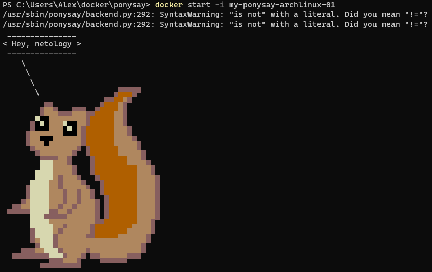
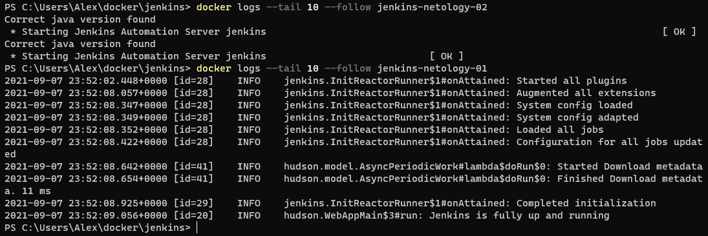
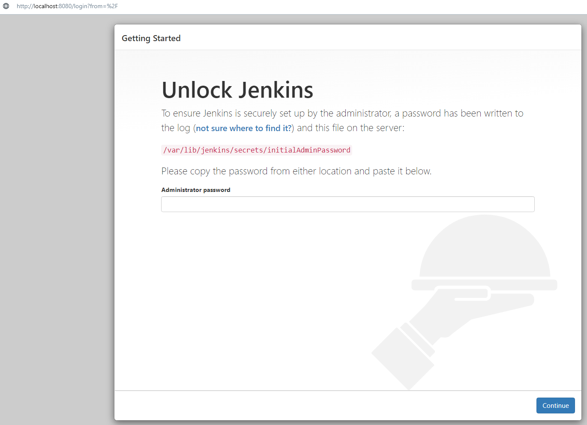
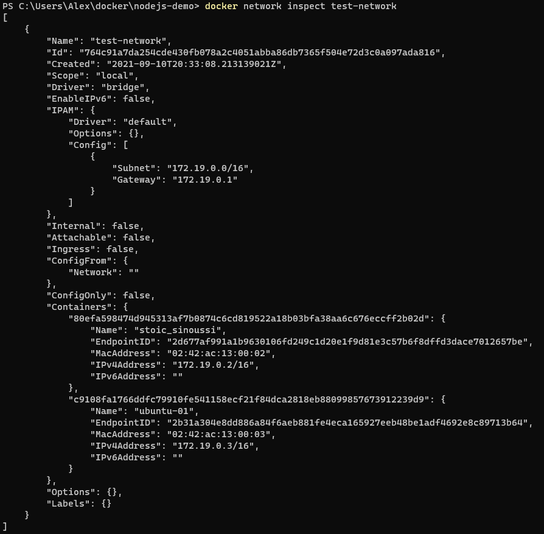
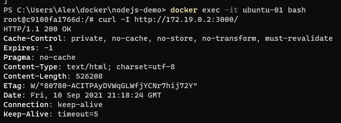

1.
    - Написанный вами Dockerfile
    
        FROM archlinux:latest
        
        RUN pacman -Syu --noconfirm && \
            pacman -S --noconfirm base-devel && \
            cd ~ && \
            mkdir ponysay && \
            cd ponysay && \
            curl -L -O https://aur.archlinux.org/cgit/aur.git/snapshot/ponysay-free.tar.gz && \
            tar -xvf ponysay-free.tar.gz && \
            cd ponysay-free && \
            env EUID=1 makepkg -sirc --noconfirm
        
        ENTRYPOINT ["/usr/sbin/ponysay"]
        CMD ["Hey, netology"]
    
    - Скриншот вывода командной строки после запуска контейнера из вашего базового образа
    
    
    
    - Ссылку на образ в вашем хранилище docker-hub
    
    

2.
    - Наполнения 2х Dockerfile из задания
    
    Dockerfile 1
    
        FROM amazoncorretto:latest
        
        COPY ./entrypoint.sh /root/entrypoint.sh
        RUN chmod u-x /root/entrypoint.sh
        
        ENTRYPOINT ["/root/entrypoint.sh"]
        
    entrypoint.sh
        
        #!/bin/bash
        if [[ ! -d /root/jenkins ]]
        then
            cd ~
            mkdir jenkins
            cd jenkins
            curl -L -O https://get.jenkins.io/war-stable/2.303.1/jenkins.war
        else
            cd /root/jenkins
        fi
        java -jar jenkins.war
    
    Dockerfile 2
    
        FROM ubuntu:latest
        
        ENV TZ=Europe/Moscow
        RUN ln -snf /usr/share/zoneinfo/$TZ /etc/localtime && echo $TZ > /etc/timezone
        RUN apt-get update && \
            apt-get install -y software-properties-common && \
            apt-get install -y wget && \
            cd ~ && \
            wget -q -O - https://pkg.jenkins.io/debian-stable/jenkins.io.key | apt-key add - && \
            sh -c 'echo deb https://pkg.jenkins.io/debian-stable binary/ > /etc/apt/sources.list.d/jenkins.list' && \
            apt-get update && \
            apt install -y openjdk-8-jdk && \
            apt-get install -y jenkins
        EXPOSE 8080
        CMD /etc/init.d/jenkins start && sleep 1000000
    
    - Скриншоты логов запущенных вами контейнеров (из командной строки)
    
    
    
    - Скриншоты веб-интерфейса Jenkins запущенных вами контейнеров (достаточно 1 скриншота на контейнер)
    
    
    
    
    
    - Ссылки на образы в вашем хранилище docker-hub
    
    

3.
    - Наполнение Dockerfile с npm приложением
    
        FROM node:latest
        
        # Create app directory
        WORKDIR /usr/src/app
        
        # Install app dependencies
        # A wildcard is used to ensure both package.json AND package-lock.json are copied
        # where available (npm@5+)
        COPY package*.json ./
        
        RUN npm install
        
        # Bundle app source
        COPY . .
        
        EXPOSE 3000
        CMD [ "node", "app.js", "0.0.0.0" ]
    
    - Скриншот вывода вызова команды списка docker сетей (docker network cli)
    
    
    
    - Скриншот вызова утилиты curl с успешным ответом
    
    